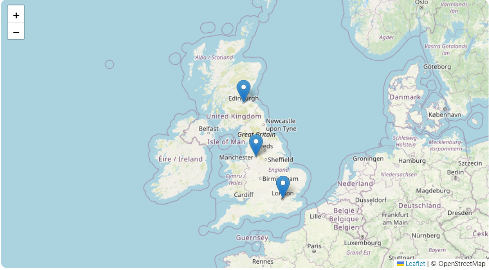

Elanco Tick Sightings Tracker (MVP)

Created by Muhammad Isfahan

### Live Demo

You can open the live version of the Tick Sightings Tracker here:
https://isfahankb.github.io/elanco-tick-sightings-mvp/

The site loads instantly in the browser and includes the interactive map, filtering system and the details panel.

### Preview

A screenshot of the live app will appear here once added.  
The image will be stored inside the `screenshots` folder in this repository.

Overview

This project is a small MVP called the Elanco Tick Sightings Tracker. I built it to show how tick activity across the UK can be visualised in a simple and useful way. Instead of treating this task like a coding exercise, I approached it as a complete mini data product. The focus is on clarity, ease of use and giving pet owners and vets something meaningful.

The application helps users explore where ticks have been reported, understand the species involved and learn how to reduce risk. It also shows how the data can be filtered, analysed and eventually scaled into a full internal tool.

The project runs fully in the browser. There is no backend setup, no installations and nothing complicated. You only need to open the index.html file.

Purpose and how it supports Elanco

Ticks affect both animals and humans. Understanding when and where they appear can help reduce infections, guide treatment and increase awareness. The goal of this MVP is to make tick information visual and easy to understand.

This aligns naturally with Elanco’s mission which focuses on improving animal health and supporting better outcomes. A simple tool like this can help owners, vets and even internal teams make better decisions based on clear data.

Key Features

The main feature is an interactive map of the UK built with Leaflet. Each sighting appears as a marker and includes species, severity, location and timestamp.

There is a filter system that lets users select a date range, species and location. When filters change, the map and details update instantly.

The right-hand panel shows more information about the selected sighting and includes a small education section with three tabs. These give quick and practical information about species, prevention and seasonal activity.

There is also a basic report form where a user can enter the time, date, species and location of a new sighting. For the MVP this only logs to the console, but the structure is ready for an API.

Technical Structure

The project uses three files.

index.html handles the layout and includes links to the CSS and JavaScript.

style.css controls the design and layout.

app.js manages the data, the map, the filtering system and all dynamic updates.

There are no external libraries apart from Leaflet and no frameworks. The file structure is clean and simple.

Data Model

Each sighting contains realistic attributes.

These include the species name, the Latin name, location, coordinates, severity rating and the timestamp.

This format makes it very easy to replace the sample data with real data coming from an API, a CSV file or a database.

Thinking Behind The Design

My goal was to keep the interface extremely clear and easy to use. The colours, spacing and alignment make the layout feel calm and organised. The map is the main visual element because most users want to see tick activity geographically.

The filter system mirrors how an analyst would explore real data: by narrowing down species, regions and time periods. The right panel gives the context needed to actually understand the sighting, not just stare at a point on a map.

The education tabs were included because data alone is not always enough. People need quick guidance that helps them make decisions. This is especially important when dealing with parasites, seasonality and prevention.

Possible Next Steps

If this MVP grew into a real internal tool, I would begin by connecting it to a live data source. After that I would add heatmaps, a time slider for seasonal trends, a proper reporting system and a vet-focused dashboard that shows larger patterns.

Later versions could include risk scoring, alerts, weather integration and even a mobile version for pet owners. These steps would turn it into a complete analytical and educational platform.

How To Run The Project

Open the index.html file in any browser.

Everything loads automatically.

No installation or setup is required.

Final Note

I really enjoyed building this small MVP. It brings together data, design and clear communication, which are all areas I care about. I created the project to show how I think, how I problem solve and how I approach user experience even in simple tasks.

Thank you for reviewing my work.

